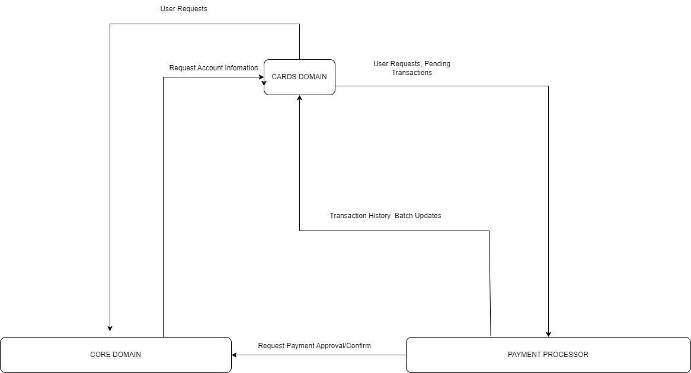

# CARDS Domain Microservices and Utilities
## Overview
In a fictional Bank, the Cards Domain division, designs, implements and supports software, that provides to the customers of the Bank credit card related services.
There are two categories of services:

1. Information-related requests from a client, such as an Account Information, Transaction History, etc.
2. User requests such as reporting a card as 'Lost or Stollen', requesting a replacement for a damaged Card, etc.

The above services are consumed from various channels of the Bank such as 'Web Banking', 'Mobile Phone Banking', and 'Retail Banking'.
The Cards Domain does not 'own' most of these data, and the required data are extracted and transformed from services of the other domains.

In the scope of this, we consider two collaborating domains:
1. Core Domain: Covers most of the traditional banking IT operations. From the perspective of the Cards Domain, there are two categories of services that are relevant, payments and account information. Since Core Domain owns Retail Banking, he consumes Card Domain services related to user requests. Specificaly Core Domains:
- Receives payments from customers and credits the credit card account.
- Receives from the payment processor transactions for merchant payments, which are accepted or rejected based on the card's balance and debits the credit card account accordingly. 
- Receives from the payment processor cancelation or refunds for a previous transaction.
- Received through Retail Banking or Help Desk Card related user requests that are propagated to the Cards Domain.
2. Payment Processor: Third-party entity that provides the infrastructure to allow Bank Credit Card customers to perform transactions with the various merchants. The infrastructure is tightly coupled to Core Banking.
- Issues the card and links it with an account in Core Domain.
- Receives Credit Cards payments request from Merchants and requests authorization from the Core Domain as described above.
- Provides real time information about pending transactions.
- Provides batch updates about completed transactions.

[Rest Services Outline](Services Outline.md)
